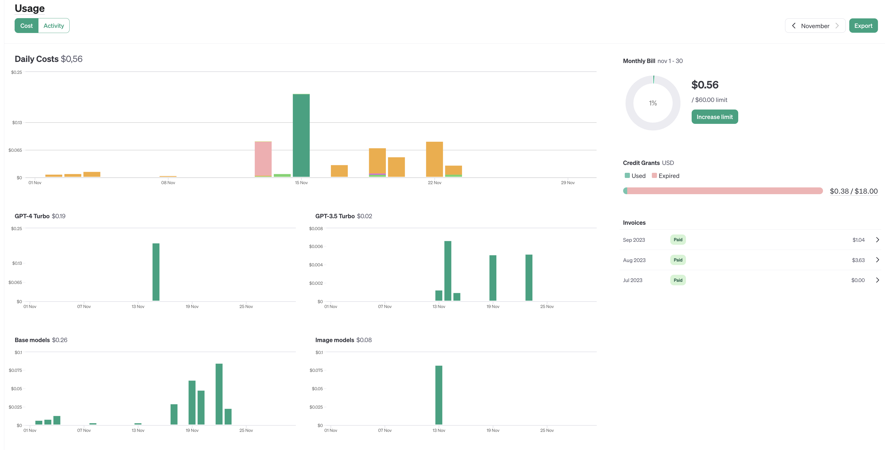
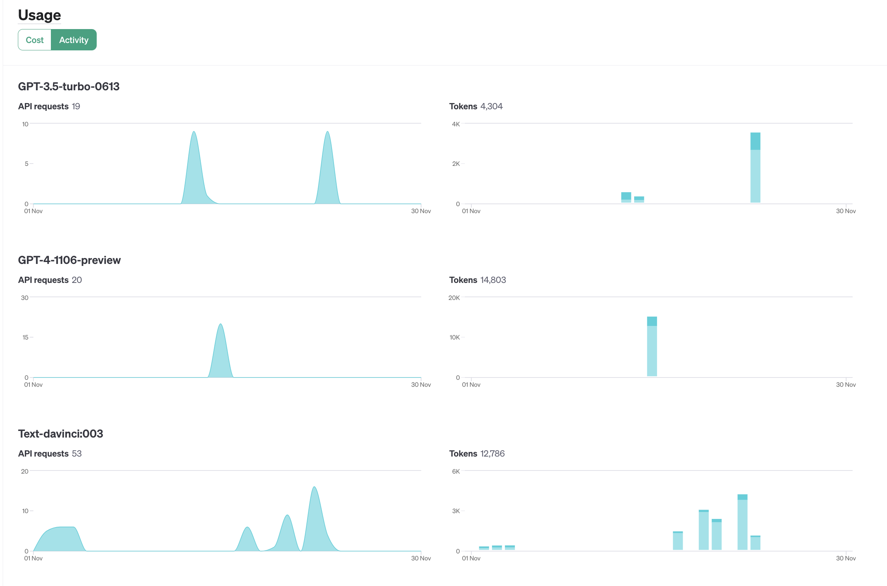

## Chat Completions API 

This folder contains examples of the [OpenAI Chat Completions API](https://platform.openai.com/docs/guides/text-generation/chat-completions-api)


## November 2023 OpenAI Update

The [completion API](https://platform.openai.com/docs/api-reference/completions) that is used in the branch `main` of the project is now labelled as `legacy`.

The legacy **Completion API** for a  given a prompt, makes the model to return 

- one or more predicted completions along with 
- the probabilities of alternative tokens at each position. 

Most developer should use  

- [Chat Completions API](https://platform.openai.com/docs/guides/text-generation/text-generation-models) 
  - See <https://platform.openai.com/docs/guides/text-generation/chat-completions-api>

Most models that support the legacy Completions endpoint [will be shut off on January 4th, 2024](https://platform.openai.com/docs/deprecations/).

I have installed the `openai` package version `4.20.0`:

```
➜  serpapi git:(dev) npm ls openai
langchain-mini@1.0.0 /Users/casianorodriguezleon/campus-virtual/2223/learning/openai-learning/langchain-mini
└── openai@4.20.0
```


## Chat Completions API Introduction

The [Chat Completions API](https://platform.openai.com/docs/guides/text-generation/chat-completions-api) is a general-purpose tool for building chatbots and dialogue systems.

```js
const completion = await openai.chat.completions.create({
    messages: [{"role": "system", "content": "You are a helpful assistant."},
        {"role": "user", "content": "Who won the world series in 2020?"},
        {"role": "assistant", "content": "The Los Angeles Dodgers won the World Series in 2020."},
        {"role": "user", "content": "Where was it played?"}],
    model: "gpt-3.5-turbo",
  });
```

Messages must be an array of message objects, where each object has a **`role`** and a **`content`**. 
The `role` can be  

1. "`system`", 
2. "`user`", or 
3. "`assistant`" 


Conversations can be as short as one message or many back and forth turns.

Typically, a conversation is formatted with 

1. a **system message** first, followed by 
2. alternating **user** and **assistant** messages.

The **system message** helps set the behavior of the assistant. 
For example, you can 

- modify the **personality** of the assistant or 
- provide specific instructions about how it should behave throughout the conversation.

**Assistant messages** store previous assistant responses, **but can also be written by you to give examples of desired behavior**.

Including conversation history is important when user instructions refer to prior messages. 

In the example above, the user’s final question of `"Where was it played?"` only makes sense 
in the context of the prior messages about the World Series of 2020.

Because the **models have no memory of past requests**, all relevant information must be supplied as part of the conversation history in each request. 

If a conversation cannot fit within the model’s token limit, it will need to be shortened in some way.

## Chat Completions response format

An example Chat Completions API response looks as follows:

```js
> node openai4/example-1.mjs

{
  id: 'chatcmpl-8O6ym4bG1TK4S7iv4zjAdAVM34xP3',
  object: 'chat.completion',
  created: 1700757392,
  model: 'gpt-3.5-turbo-0613',
  choices: [
    {
      index: 0,
      message: {
        role: 'assistant',
        content: 'El actual profesor coordinador de la asignatura "Procesadores de Lenguajes" es el profesor \n' +
          'Casiano Rodríguez León. \n' +
          'Puedes contactar con él en la dirección de correo electrónico crguezl@ull.edu.es'
      },
      finish_reason: 'stop'
    }
  ],
  usage: { prompt_tokens: 491, completion_tokens: 54, total_tokens: 545 }
}
```

Every response will include a `finish_reason`. The possible values for finish_reason are:

- `stop`: API returned complete message, or a message terminated by one of the stop sequences provided via the [stop](https://platform.openai.com/docs/api-reference/chat/create#chat/create-stop) parameter
- `length`: Incomplete model output due to [max_tokens](https://platform.openai.com/docs/api-reference/chat/create#chat/create-max_tokens) parameter or token limit
- `function_call`: The model decided to call a function
- `content_filter`: Omitted content due to a flag from OpenAI content filters
- `null`: API response still in progress or incomplete

Depending on input parameters, the model response may include different information.

## JSON mode 

Text generation models are now capable of 

- [JSON mode](https://platform.openai.com/docs/guides/text-generation/json-mode) and 
- [Reproducible outputs](https://platform.openai.com/docs/guides/text-generation/reproducible-outputs). 

A common way to use Chat Completions is to instruct the model **to always return a JSON object** that makes sense for your use case, by specifying this in the **system message**. While this does work in some cases, occasionally the models may generate output that does not parse to valid JSON objects.

To prevent these errors and improve model performance, when calling 

- `gpt-4-1106-preview` or 
- `gpt-3.5-turbo-1106`, 

you can set `response_format` to `{ "type": "json_object" }` to enable [JSON mode](https://platform.openai.com/docs/guides/text-generation/json-mode). 

When **JSON mode** is enabled, **the model is constrained to only generate strings that parse into valid JSON object**.

```js
const completion = await openai.chat.completions.create({
    messages: [
      {
        role: "system",
        content: "You are a helpful assistant designed to output JSON.",
      },
      { role: "user", content: "Who won the world series in 2020?" },
    ],
    model: "gpt-3.5-turbo-1106",
    response_format: { type: "json_object" },
  });
```

Important notes:

- When using JSON mode, always instruct the model to produce JSON via some message in the conversation, for example via your **system message**[^1]. 
- The JSON in the message the model returns may be partial (i.e. cut off) if `finish_reason` is `length`, which indicates the generation exceeded `max_tokens` or the conversation exceeded the token limit. To guard against this, check `finish_reason` before parsing the response:
  
  ```js
  let firstMessage = completion.choices[0];
  if (firstMessage.finish_reason === "stop") {
    console.log(JSON.parse(firstMessage.message.content));
  } else {
    console.log(`The completion did not finish due to timeout: ${deb(completion)}`);
  }
  ```
  which outputs:
  ```js
  {
    error: 'There was no World Series in 2020 due to the COVID-19 pandemic.'
  }
  ```
JSON mode will not guarantee the output matches any specific [schema](https://json-schema.org/overview/what-is-jsonschema)[^2], only that it is valid and parses without errors.

[^1]: If you don't include an explicit instruction to generate JSON, the model may generate an unending stream of whitespace and the request may run continually until it reaches the token limit. To help ensure you don't forget, the API will throw an error if the string `"JSON"` does not appear somewhere in the context.

[^2]: JSON Schema is a declarative language that you can use to annotate and validate the structure, constraints, and data types of your JSON documents. It provides a way to standardize and define expectations for your JSON data. See
<https://json-schema.org/overview/what-is-jsonschema>

See the code at [openai4/json-mode.mjs](openai4/json-mode.mjs) for an example. Follows an execution example:

```
➜  langchain-mini git:(main) node openai4/json-mode.mjs
```
```js
{
  id: 'chatcmpl-8OCBnLI7QLRH1Oehi0yZGfYLVIC2c',
  object: 'chat.completion',
  created: 1700777419,
  model: 'gpt-3.5-turbo-1106',
  choices: [
    {
      index: 0,
      message: {
        role: 'assistant',
        content: '{\n  "winner": "Los Angeles Dodgers"\n}'
      },
      finish_reason: 'stop'
    }
  ],
  usage: { prompt_tokens: 31, completion_tokens: 11, total_tokens: 42 },
  system_fingerprint: 'fp_eeff13170a'
}
```

## Prices

The following paragraph has 35 words and 35 tokens:

```
✗ echo 'Multiple models, each with different capabilities and price points.
Prices are per 1,000 tokens.
You can think of tokens as pieces of words, where 1,000 tokens is about 750 words.
This paragraph is 35 tokens.' | wc
       4      35     211
```

See <https://openai.com/pricing>

Here is an example of cost and usage:

| Cost                          | Usage |
| ---                           | --- |
|  |  |


It is a paymnet system based on tokens.

## References

* Integrate OpenAI Assistants into your Web App (Tutorial): <https://youtu.be/lTF43_-TjbQ?si=HcK46HA9wxQYps70>